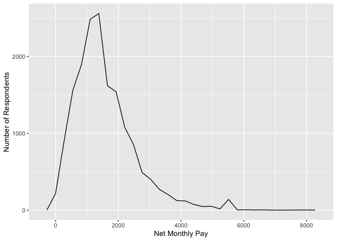
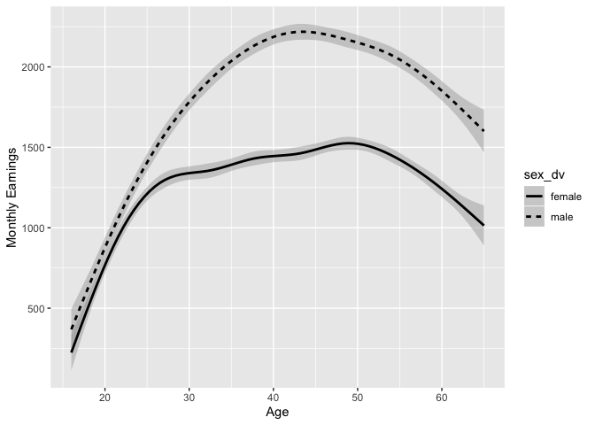
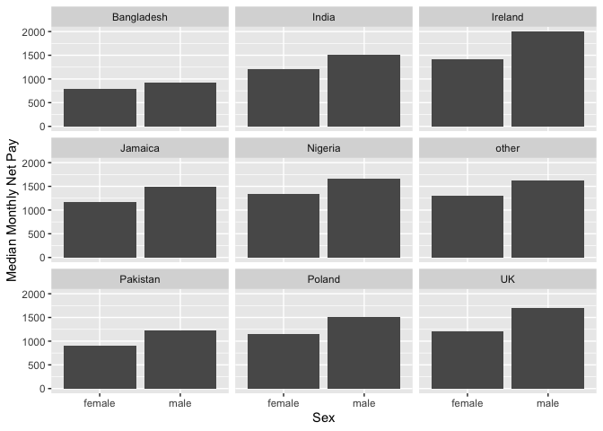
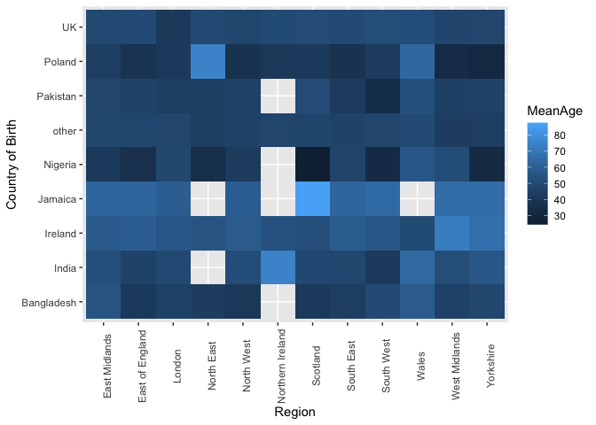
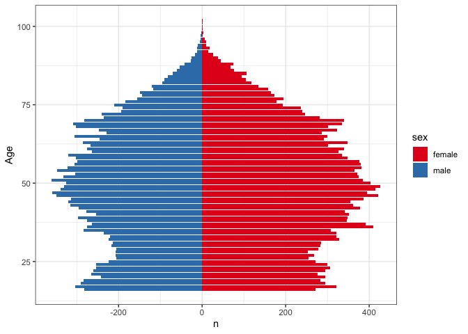

Statistical assignment 4
================
\[Toby Baines - 670030310\]
\[26/02/20\]

In this assignment you will need to reproduce 5 ggplot graphs. I supply
graphs as images; you need to write the ggplot2 code to reproduce them
and knit and submit a Markdown document with the reproduced graphs (as
well as your .Rmd file).

First we will need to open and recode the data. I supply the code for
this; you only need to change the file paths.

    ```r
    library(tidyverse)
    Data8 <- read_tsv("/Users/user/Data3_2020/UKDA-6614-tab/tab/ukhls_w8/h_indresp.tab")
    Data8 <- Data8 %>%
        select(pidp, h_age_dv, h_payn_dv, h_gor_dv)
    Stable <- read_tsv("/Users/user/Data3_2020/UKDA-6614-tab/tab/ukhls_wx/xwavedat.tab")
    Stable <- Stable %>%
        select(pidp, sex_dv, ukborn, plbornc)
    Data <- Data8 %>% left_join(Stable, "pidp")
    rm(Data8, Stable)
    
    Data <- Data %>%
        mutate(sex_dv = ifelse(sex_dv == 1, "male",
                           ifelse(sex_dv == 2, "female", NA))) %>%
        mutate(h_payn_dv = ifelse(h_payn_dv < 0, NA, h_payn_dv)) %>%
        mutate(h_gor_dv = recode(h_gor_dv,
                         `-9` = NA_character_,
                         `1` = "North East",
                         `2` = "North West",
                         `3` = "Yorkshire",
                         `4` = "East Midlands",
                         `5` = "West Midlands",
                         `6` = "East of England",
                         `7` = "London",
                         `8` = "South East",
                         `9` = "South West",
                         `10` = "Wales",
                         `11` = "Scotland",
                         `12` = "Northern Ireland")) %>%
        mutate(placeBorn = case_when(
                ukborn  == -9 ~ NA_character_,
                ukborn < 5 ~ "UK",
                plbornc == 5 ~ "Ireland",
                plbornc == 18 ~ "India",
                plbornc == 19 ~ "Pakistan",
                plbornc == 20 ~ "Bangladesh",
                plbornc == 10 ~ "Poland",
                plbornc == 27 ~ "Jamaica",
                plbornc == 24 ~ "Nigeria",
                TRUE ~ "other")
        )
    ```

Reproduce the following graphs as close as you can. For each graph,
write two sentences (not more\!) describing its main message.

1.  Univariate distribution (20 points).
    
    ``` r
        ggplot(data = Data, aes(x = h_payn_dv)) +
        geom_freqpoly() +
        labs( y = "Number of Respondents", x = "Net Monthly Pay")
    ```
    
    <!-- --> The
    graph portrays net monthly pay mainly being concentrated around the
    1300-1400 mark. From here onwards the number of respondents with
    higher pay decreases despite the small increase around 5500.

2.  Line chart (20 points). The lines show the non-parametric
    association between age and monthly earnings for men and
    women.
    
    ``` r
    ggplot(Data, mapping = aes(x = h_age_dv, y = h_payn_dv,linetype = sex_dv)) +
    geom_smooth(color = "black") +
    xlab("Age") +
    ylab("Monthly Earnings") +
    xlim(16,65) 
    ```
    
    <!-- --> This
    indicates that male monthly earnings are higher than that of women
    regardless of age. However, whilst male earnings increase sharply
    until early forties, female earnings begin to plateau at around 27,
    although steadily increase for longer than men.

3.  Faceted bar chart (20 points).
    
    ``` r
    PayNatSex <- Data %>%
        group_by(placeBorn, sex_dv) %>%
        summarise(
            monthly = median(h_payn_dv, na.rm = TRUE)
        ) %>%
            filter(!is.na(sex_dv)) %>%
        filter(!is.na(placeBorn)) %>%
        ggplot(aes(x = sex_dv, y = monthly)) +
        geom_bar(stat = "Identity") +
        labs(x = "Sex", y = "Median Monthly Net Pay")+
        facet_wrap(~ placeBorn)
    
    PayNatSex
    ```
    
    <!-- -->
    Looking at median monthly net pay by sex and place of birth we can
    see that men earn more than women in all cases. The graphs also
    indicate the difference overall in monthly net pay according to
    place of birth. For instance Bangladeshis earn comparatively less
    than Irish.

4.  Heat map (20 points).
    
    ``` r
    byregion <- Data %>% 
        group_by(placeBorn, h_gor_dv) %>%
        summarise(
            MeanAge = mean(h_age_dv, na.rm = TRUE)) %>%
            filter(!is.na((placeBorn))) %>%
            filter(!is.na(h_gor_dv))
    
    byregion %>%
        ggplot(aes(x = h_gor_dv, y = placeBorn, fill = MeanAge)) +
        geom_tile() +
        ylab("Country of Birth") +
        xlab("Region") +
        theme(axis.text.x = element_text(angle = 90))
    ```
    
    <!-- -->
    Comparing mean age by country of birth and region we can see that
    across the board the average age is between 40-50. Northern Ireland
    lacks data on Bangladeshis, Jamaicans, Nigerians, and Pakistanis.
    British people have the most stable mean age across regions.

5.  Population pyramid (20 points).
    
    ``` r
    Agebysex <- Data %>%
        filter(!is.na(h_age_dv) & !is.na(sex_dv)) %>%
        group_by(h_age_dv, sex_dv) %>%
        count(h_age_dv) %>%
        mutate(n = if_else(sex_dv == "male", -n, n)) %>%
        rename(sex = sex_dv)
    Agebysex %>%
        ggplot(aes(x = h_age_dv, y = n, fill = sex)) +
        geom_bar(data = subset(Agebysex, sex = "Female"), stat = "Identity") +
        geom_bar(data = subset(Agebysex, sex = "Male"), stat = "Identity") +
        xlab("Age") +
        coord_flip() +
        scale_fill_brewer(palette = "Set1") +
        theme_bw()
    ```
    
    <!-- --> The
    pyramid indicates similar number of males and females at varying
    ages in society. On the whole there are more women.
